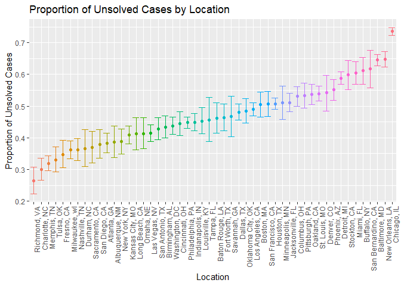
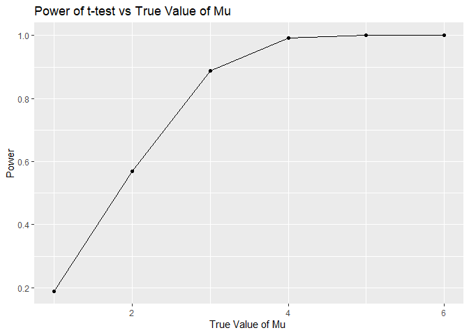

p8105_hw5_sm5134
================
Sneha Mehta
2022-11-15

``` r
library(tidyverse)
knitr::opts_chunk$set(echo = TRUE)
```

## Problem 1

``` r
dataframe = 
  tibble(
    files = list.files("./hw5_data/data/"),
    path = str_c("./hw5_data/data/", files)
  ) %>% 
  mutate(data = map(path, read_csv))  %>% 
  unnest()
```

Tidying dataframe

``` r
dataframe_tidy = 
  dataframe %>% 
  mutate(
    files = str_replace(files, ".csv", ""),
    group = str_sub(files, 1, 3)) %>% 
  pivot_longer(
    week_1:week_8,
    names_to = "week",
    values_to = "outcome",
    names_prefix = "week_") %>% 
  mutate(week = as.numeric(week)) %>% 
  select(group, subj = files, week, outcome)
```

Creating spaghetti plot

``` r
dataframe_tidy %>% 
  ggplot(aes(x = week, y = outcome, group = subj, color = group)) + 
  geom_point() + 
  geom_path() + 
  facet_grid(~group)
```

<!-- -->
From the plot we can see that over the course of the study, the outcome
measure for the control group was relatively stagnant. However, the
outcome measure increased over time for the experimental group.

## Problem 2

Import and clean data

``` r
homicide = read_csv("./hw5_data/homicide-data.csv") %>% 
  janitor::clean_names() %>% 
  mutate(state = case_when(city == "Tulsa" ~ "OK", TRUE ~ as.character(state))) %>% 
  mutate(city_state = str_c(city, state, sep = ", "))
```

This dataset describes homicides that took place in 50 cities across the
U.S. It contains 52,179 observations across 13 variables, including ID;
reported date; first and last name of victim; victim race, age, and sex,
location (city, state, latitude, and longitude), and disposition. The
dataset originally contained 51 observations. Upon closer inspection, I
noticed one homicide was supposedly located in Tulsa, AL. I confirmed
that Tulsa, AL does not exist through an internet search, and then
presumed this was a typo and that this observation was meant to recorded
as Tulsa, OK. I corrected this in the code above.

Summarizing total homicides and total unsolved cases by city

``` r
homicide_summ = homicide %>% 
  group_by(city_state) %>% 
  summarise(homicide_total = n(), 
            unsolved = sum(!(disposition == "Closed by arrest"))) 
```

``` r
# Proportion test for Baltimore
baltimore = homicide_summ %>% 
  filter(city_state == "Baltimore, MD") 
  
balt_ttest = 
  prop.test(
    x = baltimore %>% pull(unsolved),
    n = baltimore %>% pull(homicide_total),
    alternative = c("two.sided"),
    conf.level = 0.95,
    correct = TRUE) %>% 
  broom::tidy() %>% 
  select(estimate, conf.low, conf.high)

# Proportion Tests for All Cities
all_cities = homicide_summ %>% 
  mutate(newcol = map2(unsolved, homicide_total, ~ prop.test(.x, n = .y) %>% 
                         {tibble(estimate = .[["estimate"]],
                                 CI_Lower = .[["conf.int"]][[1]],
                                 CI_Upper = .[["conf.int"]][[2]])})) %>% 
  unnest()

# Plot estimates and CIs
all_cities %>% 
  mutate(city_state = fct_reorder(city_state, estimate)) %>% 
  ggplot(aes(x = city_state, y = estimate, color = city_state)) + 
  geom_point() + 
  geom_errorbar(aes(ymin = CI_Lower, ymax = CI_Upper)) +
  labs(
    x = "Location",
    y = "Proportion of Unsolved Cases",
    title = "Proportion of Unsolved Cases by Location") +
  theme(legend.position = "none", axis.text.x = element_text(angle = 90, hjust = 1))
```

<!-- -->
This plot shows the estimated proportion of unsolved cases by city.
Richmond, VA had the lowest proportion of unsolved cases and Chicago, IL
had the highest.

## Problem 3

``` r
set.seed(1)

#creating function
sim_t_test = function(mu) {
  sample = rnorm(30 , mean = mu, sd = 5)
ttest = t.test(sample) %>% 
  broom::tidy()
}

#testing function
sim_t_test(mu = 0) %>% view()
  
#generating 5000 iterations when mu = 0
sim_results_df0 = expand_grid(
  mu = 0,
  iter = 1:5000
) %>% 
  mutate(
    test_df = map(mu, sim_t_test)
  ) %>% 
  unnest(test_df)
  
#generating 5000 datasets when mu = 1-6
sim_results_df = expand_grid(
  mu = c(1:6),
  iter = 1:5000
) %>% 
  mutate(
    test_df = map(mu, sim_t_test)
  ) %>% 
  unnest(test_df)

sim_results_df = sim_results_df%>% 
  mutate(reject_h0 = ifelse(p.value < 0.05, TRUE, FALSE))

power_plot = sim_results_df %>% 
  group_by(mu) %>% 
  mutate(power = sum(reject_h0)/5000) %>% 
  ggplot(aes(x = mu, y = power)) +
  geom_point() + 
  geom_line() +
  labs(
    x = "True Value of Mu ",
    y = "Power",
    title = "Power of t-test vs True Value of Mu")

power_plot
```

<!-- -->
