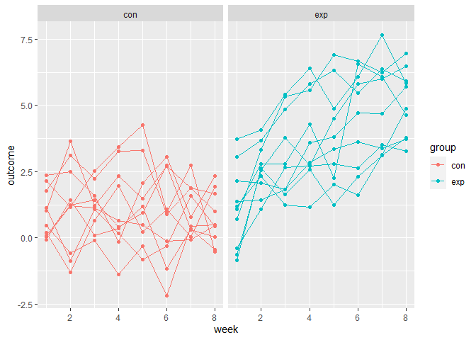

p8105_hw5_sm5134
================
Sneha Mehta
2022-11-15

``` r
library(tidyverse)
knitr::opts_chunk$set(echo = TRUE)
```

## Problem 1

``` r
dataframe = 
  tibble(
    files = list.files("./hw5_data/data/"),
    path = str_c("./hw5_data/data/", files)
  ) %>% 
  mutate(data = map(path, read_csv))  %>% 
  unnest()
```

Tidying dataframe

``` r
dataframe_tidy = 
  dataframe %>% 
  mutate(
    files = str_replace(files, ".csv", ""),
    group = str_sub(files, 1, 3)) %>% 
  pivot_longer(
    week_1:week_8,
    names_to = "week",
    values_to = "outcome",
    names_prefix = "week_") %>% 
  mutate(week = as.numeric(week)) %>% 
  select(group, subj = files, week, outcome)
```

Creating spaghetti plot

``` r
dataframe_tidy %>% 
  ggplot(aes(x = week, y = outcome, group = subj, color = group)) + 
  geom_point() + 
  geom_path() + 
  facet_grid(~group)
```

<!-- -->
From the plot we can see that over the course of the study, the outcome
measure for the control group was relatively stagnant. However, the
outcome measure increased over time for the experimental group.

## Problem 2

Import and clean data

``` r
homicide = read_csv("./hw5_data/homicide-data.csv") %>% 
  janitor::clean_names() %>% 
  mutate(city_state = str_c(city, state, sep = ", "))
```

This dataset describes homicides that took place in 50 cities across the
U.S. It contains 52,179 observations across 13 variables, including ID;
reported date; first and last name of victim; victim race, age, and sex,
location (city, state, latitude, and longitude), and disposition.

Summarizing total homicides and total unsolved cases by city

``` r
homicide_summ = homicide %>% 
  group_by(city_state) %>% 
  summarise(homicide_total = n(), 
            unsolved = sum(!(disposition == "Closed by arrest")))
```

``` r
# Proportion test for Baltimore
baltimore = homicide_summ %>% 
  filter(city_state == "Baltimore, MD") 
  
balt_ttest = 
  prop.test(
    x = baltimore %>% pull(unsolved),
    n = baltimore %>% pull(homicide_total),
    alternative = c("two.sided"),
    conf.level = 0.95,
    correct = TRUE) %>% 
  broom::tidy() %>% 
  select(estimate, conf.low, conf.high)

# Proportion Tests for All Cities
all_cities = homicide_summ %>% 
  mutate(newcol = map2(unsolved, homicide_total, ~ prop.test(.x, n = .y) %>% 
                         {tibble(estimate = .[["estimate"]],
                                 CI_Lower = .[["conf.int"]][[1]],
                                 CI_Upper = .[["conf.int"]][[2]])})) %>% 
  unnest()
```

    ## Warning in prop.test(.x, n = .y): Chi-squared approximation may be incorrect

    ## Warning: `cols` is now required when using unnest().
    ## Please use `cols = c(newcol)`

``` r
# Plot estimates and CIs
all_cities %>% 
  mutate(city_state = fct_reorder(city_state, estimate)) %>% 
  ggplot(aes(x = city_state, y = estimate, color = city_state)) + 
  geom_point() + 
  geom_errorbar(aes(ymin = CI_Lower, ymax = CI_Upper)) +
  labs(
    x = "Location",
    y = "Proportion of Unsolved Cases",
    title = "Proportion of Unsolved Cases by Location") +
  theme(legend.position = "none", axis.text.x = element_text(angle = 90, hjust = 1))
```

<!-- -->

## Problem 3
